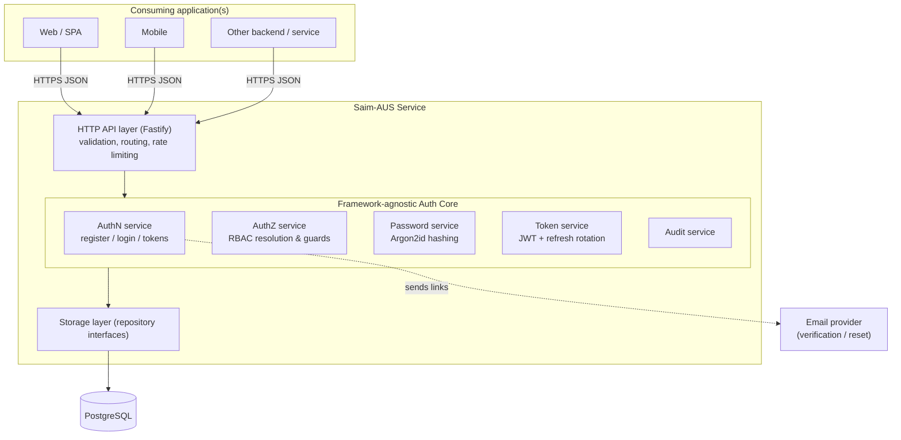
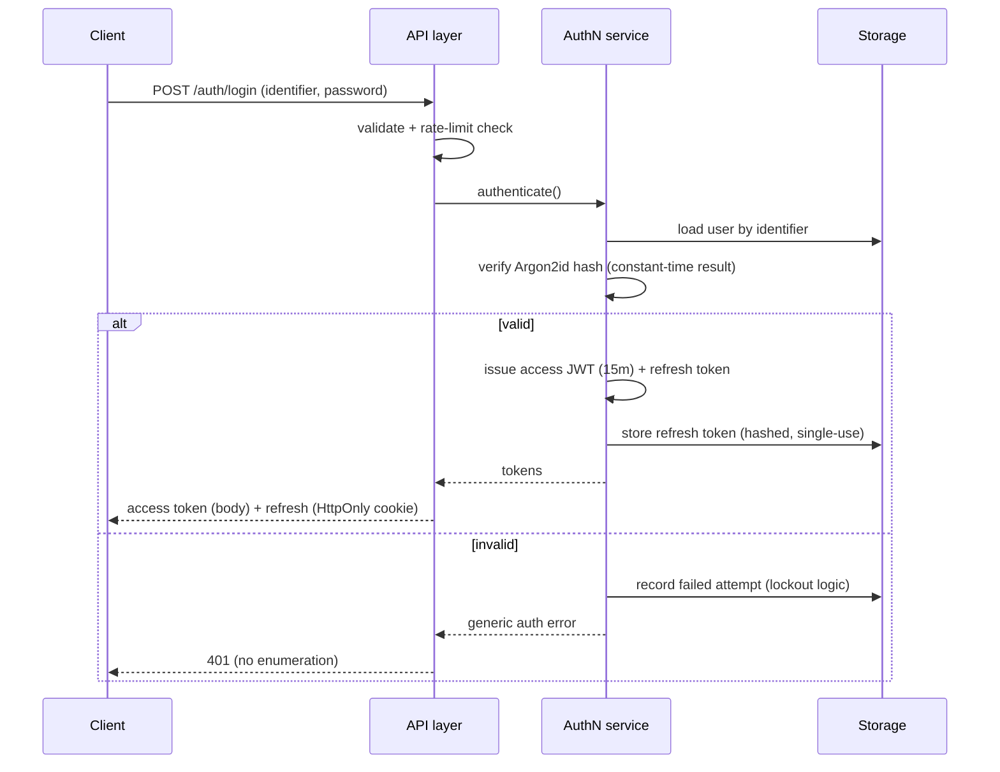
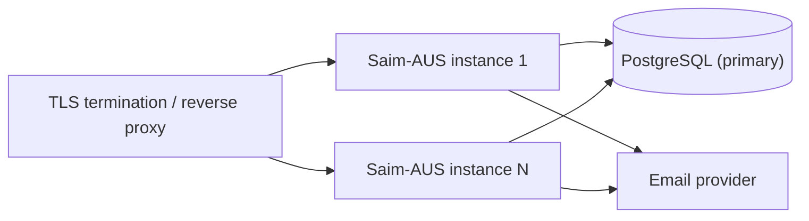

# Architecture Document
## Saim-AUS — Phase 1 Design

**Version:** 0.1 (Draft) · **Date:** 2026-09-22 · **Depends on:** [ADRs](00-Decisions-ADR.md)

---

## 1. Goals & principles

- **Secure by default** — deny-by-default authz, secure cookie flags, least privilege.
- **Separation of concerns** — thin HTTP layer, framework-agnostic core, pluggable storage.
- **Stateless hot path** — access-token verification needs no DB call.
- **Portable & free** — self-hostable, MIT-licensed, runs on commodity infra.

## 2. High-level architecture



## 3. Layered design

| Layer | Responsibility | Notes |
|-------|----------------|-------|
| **Transport (HTTP API)** | Routing, JSON-Schema request validation, rate limiting, cookie handling, error mapping | Fastify; thin — no business logic |
| **Application / Services** | AuthN, AuthZ, Password, Token, Audit use-cases | Framework-agnostic core; the reusable heart |
| **Domain** | Entities & rules: User, Role, Permission, Session/Token, AuditEvent | Pure, testable |
| **Storage (Repositories)** | Persistence behind interfaces (`UserRepo`, `RoleRepo`, …) | Postgres impl; SQLite impl for dev |
| **Infrastructure** | DB driver, mailer, clock, crypto, config, logger | Swappable adapters |

**Dependency rule:** dependencies point inward (Transport → Application → Domain).
Storage and infrastructure are injected, so the core has no framework/DB imports.

## 4. Key runtime flows

### 4.1 Registration
1. `POST /auth/register` → validate input (schema + password policy).
2. Check identifier uniqueness (no enumeration in response).
3. Hash password (Argon2id) → persist `User(status=pending)`.
4. Issue single-use, time-limited verification token → email link.
5. Respond generically ("if valid, a verification email was sent").

### 4.2 Login


### 4.3 Access-token verification (hot path, stateless)
1. Client sends `Authorization: Bearer <access JWT>`.
2. API verifies signature + expiry locally (no DB call).
3. Claims include `sub` (user id) and effective permissions/roles snapshot (or a version marker).
4. AuthZ guard checks required permission → allow/deny (deny by default).

### 4.4 Refresh & rotation
1. `POST /auth/refresh` with refresh cookie.
2. Look up refresh token (hashed) → must exist, be unexpired, unused.
3. **Rotate:** invalidate old, issue new refresh + new access token.
4. Reuse of a consumed refresh token ⇒ treat as theft → revoke the token family.

### 4.5 Authorization decision
- Effective permissions = union of permissions across the user's roles (+ inherited roles if enabled).
- Guards declare a required permission (e.g., `user:manage`); missing ⇒ 403.

## 5. Cross-cutting concerns

| Concern | Approach |
|---------|----------|
| **Config** | Environment variables / config file; validated at boot; secrets never in code |
| **Secrets/keys** | Signing keys from env/secret store; support key rotation (kid header) |
| **Rate limiting** | Per-IP and per-account on sensitive endpoints (login, refresh, reset) |
| **Logging** | Structured logs; **never** log secrets/passwords/tokens |
| **Audit** | Security events persisted (login, logout, reset, role change, lockout) |
| **Errors** | Uniform error model; generic messages on auth failures (no enumeration) |
| **Clock/crypto** | Injected abstractions for testability and constant-time comparisons |

## 6. Deployment model



- **Stateless instances** (access-token verification needs no shared state) → scale horizontally.
- **Shared Postgres** holds users, RBAC, refresh tokens, audit.
- Runs as a container; TLS terminated at proxy/load balancer.
- Health/readiness endpoints for orchestration.

## 7. Module layout (proposed)

```
src/
  api/            # Fastify routes, schemas, middleware (transport)
  core/
    authn/        # registration, login, logout
    authz/        # RBAC resolution, guards
    password/     # Argon2id hashing, policy
    tokens/       # JWT issue/verify, refresh rotation
    audit/        # audit events
    domain/       # entities & value objects (pure)
  storage/
    interfaces/   # UserRepo, RoleRepo, PermissionRepo, TokenRepo, AuditRepo
    postgres/     # Postgres implementations + migrations
    sqlite/       # dev implementation
  infra/          # config, logger, mailer, clock, crypto adapters
  index.ts        # composition root (dependency injection wiring)
test/             # unit + integration + security tests
```

## 8. Traceability (requirements → architecture)

| Requirement area | Realized by |
|------------------|-------------|
| AuthN (FR-7..17) | `core/authn`, `core/tokens`, `core/password` |
| RBAC (FR-18..25) | `core/authz`, `domain`, `storage` RBAC tables |
| Admin (FR-26..29) | `api` admin routes + `core/authz` guards |
| Audit (FR-30) | `core/audit`, `storage/*/AuditRepo` |
| Security (SEC-1..12) | password/tokens modules, rate limiting, validation, threat-model mitigations |

## 9. Open design questions (to resolve during build)
- Embed permission snapshot in the access JWT vs. a "permissions version" claim + lookup on change.
- Migration tooling choice (e.g., node-pg-migrate / Drizzle / Prisma).
- Email delivery adapter(s) to ship by default.
