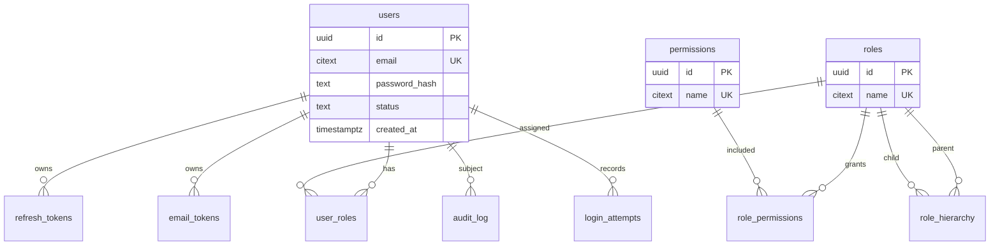

# Database Schema
## Saim-AUS — Phase 1 Design

**Version:** 0.1 (Draft) · **Date:** 2026-09-22 · **Engine:** PostgreSQL (per [ADR-004](00-Decisions-ADR.md))

> DDL is illustrative reference for design review — final migrations are produced in Phase 2.
> Principles: real foreign keys, `NOT NULL` where meaningful, unique constraints, timestamps,
> and **no plaintext secrets** stored anywhere.

---

## 1. Entity-relationship overview



## 2. Core tables (reference DDL)

```sql
-- Enable useful extensions
CREATE EXTENSION IF NOT EXISTS "pgcrypto";   -- gen_random_uuid()
CREATE EXTENSION IF NOT EXISTS "citext";     -- case-insensitive email/name

-- USERS ---------------------------------------------------------------
CREATE TABLE users (
    id             UUID PRIMARY KEY DEFAULT gen_random_uuid(),
    email          CITEXT NOT NULL UNIQUE,
    password_hash  TEXT   NOT NULL,                 -- Argon2id encoded hash (never plaintext)
    status         TEXT   NOT NULL DEFAULT 'pending' -- pending | active | disabled
                   CHECK (status IN ('pending','active','disabled')),
    email_verified BOOLEAN NOT NULL DEFAULT FALSE,
    mfa_enabled    BOOLEAN NOT NULL DEFAULT FALSE,
    mfa_secret     TEXT,                            -- encrypted at rest if used
    created_at     TIMESTAMPTZ NOT NULL DEFAULT now(),
    updated_at     TIMESTAMPTZ NOT NULL DEFAULT now(),
    last_login_at  TIMESTAMPTZ
);

-- ROLES ---------------------------------------------------------------
CREATE TABLE roles (
    id          UUID PRIMARY KEY DEFAULT gen_random_uuid(),
    name        CITEXT NOT NULL UNIQUE,             -- e.g. 'user', 'admin'
    description TEXT,
    is_system   BOOLEAN NOT NULL DEFAULT FALSE,     -- protect built-in roles from deletion
    created_at  TIMESTAMPTZ NOT NULL DEFAULT now()
);

-- PERMISSIONS ---------------------------------------------------------
CREATE TABLE permissions (
    id          UUID PRIMARY KEY DEFAULT gen_random_uuid(),
    name        CITEXT NOT NULL UNIQUE,             -- e.g. 'user:manage', 'post:delete'
    description TEXT,
    created_at  TIMESTAMPTZ NOT NULL DEFAULT now()
);

-- USER ↔ ROLE (many-to-many) -----------------------------------------
CREATE TABLE user_roles (
    user_id     UUID NOT NULL REFERENCES users(id) ON DELETE CASCADE,
    role_id     UUID NOT NULL REFERENCES roles(id) ON DELETE CASCADE,
    granted_at  TIMESTAMPTZ NOT NULL DEFAULT now(),
    granted_by  UUID REFERENCES users(id),
    PRIMARY KEY (user_id, role_id)
);

-- ROLE ↔ PERMISSION (many-to-many) -----------------------------------
CREATE TABLE role_permissions (
    role_id       UUID NOT NULL REFERENCES roles(id) ON DELETE CASCADE,
    permission_id UUID NOT NULL REFERENCES permissions(id) ON DELETE CASCADE,
    PRIMARY KEY (role_id, permission_id)
);

-- OPTIONAL: ROLE HIERARCHY (inheritance) -----------------------------
CREATE TABLE role_hierarchy (
    parent_role_id UUID NOT NULL REFERENCES roles(id) ON DELETE CASCADE,
    child_role_id  UUID NOT NULL REFERENCES roles(id) ON DELETE CASCADE,
    PRIMARY KEY (parent_role_id, child_role_id),
    CHECK (parent_role_id <> child_role_id)
);
```

## 3. Security / session tables

```sql
-- REFRESH TOKENS (rotating, single-use, revocable) -------------------
CREATE TABLE refresh_tokens (
    id           UUID PRIMARY KEY DEFAULT gen_random_uuid(),
    user_id      UUID NOT NULL REFERENCES users(id) ON DELETE CASCADE,
    token_hash   TEXT NOT NULL,                     -- store HASH of token, never the token
    family_id    UUID NOT NULL,                     -- rotation family (theft detection)
    issued_at    TIMESTAMPTZ NOT NULL DEFAULT now(),
    expires_at   TIMESTAMPTZ NOT NULL,
    consumed_at  TIMESTAMPTZ,                        -- set when rotated/used
    revoked_at   TIMESTAMPTZ,                        -- set on logout/theft
    user_agent   TEXT,
    ip_hash      TEXT                                -- hashed, not raw IP
);
CREATE INDEX idx_refresh_user   ON refresh_tokens(user_id);
CREATE INDEX idx_refresh_family ON refresh_tokens(family_id);

-- EMAIL / RESET TOKENS (single-use, time-limited) --------------------
CREATE TABLE email_tokens (
    id          UUID PRIMARY KEY DEFAULT gen_random_uuid(),
    user_id     UUID NOT NULL REFERENCES users(id) ON DELETE CASCADE,
    token_hash  TEXT NOT NULL,                       -- hash only
    purpose     TEXT NOT NULL                        -- 'verify_email' | 'password_reset'
                CHECK (purpose IN ('verify_email','password_reset')),
    expires_at  TIMESTAMPTZ NOT NULL,
    consumed_at TIMESTAMPTZ,
    created_at  TIMESTAMPTZ NOT NULL DEFAULT now()
);
CREATE INDEX idx_email_tokens_user ON email_tokens(user_id);

-- LOGIN ATTEMPTS (brute-force / lockout) -----------------------------
CREATE TABLE login_attempts (
    id           UUID PRIMARY KEY DEFAULT gen_random_uuid(),
    user_id      UUID REFERENCES users(id) ON DELETE CASCADE, -- nullable (unknown account)
    identifier   CITEXT,                              -- attempted identifier
    successful   BOOLEAN NOT NULL,
    ip_hash      TEXT,
    attempted_at TIMESTAMPTZ NOT NULL DEFAULT now()
);
CREATE INDEX idx_login_attempts_ident_time ON login_attempts(identifier, attempted_at);

-- AUDIT LOG ----------------------------------------------------------
CREATE TABLE audit_log (
    id          UUID PRIMARY KEY DEFAULT gen_random_uuid(),
    actor_id    UUID REFERENCES users(id) ON DELETE SET NULL, -- who did it
    event       TEXT NOT NULL,                        -- 'login.success', 'role.assigned', ...
    target_type TEXT,                                 -- 'user' | 'role' | 'permission'
    target_id   UUID,
    metadata    JSONB NOT NULL DEFAULT '{}'::jsonb,   -- no secrets
    ip_hash     TEXT,
    created_at  TIMESTAMPTZ NOT NULL DEFAULT now()
);
CREATE INDEX idx_audit_event_time ON audit_log(event, created_at);
```

## 4. Seed data (default RBAC)

```sql
-- Default roles
INSERT INTO roles (name, description, is_system) VALUES
    ('admin', 'Full administrative access', TRUE),
    ('user',  'Standard authenticated user', TRUE);

-- Example permissions
INSERT INTO permissions (name, description) VALUES
    ('user:read',    'View users'),
    ('user:manage',  'Create/update/disable users'),
    ('role:manage',  'Create/update/delete roles and permissions'),
    ('self:read',    'Read own profile'),
    ('self:update',  'Update own profile');

-- admin gets everything; user gets self-scoped perms
-- (association inserts done in migration/seed script)
```

## 5. Design notes & rationale

- **Hash, don't store** — refresh/email tokens are stored as **hashes**; the raw value exists
  only in transit. A DB leak does not yield usable tokens.
- **IP privacy** — IPs stored **hashed** (`ip_hash`) to support abuse detection without holding
  raw PII (supports NFR-16 privacy).
- **`citext`** for email/role/permission names → case-insensitive uniqueness (`Admin` == `admin`).
- **`is_system`** guards built-in roles from accidental deletion (FR-23).
- **Cascade deletes** keep RBAC mappings consistent when a user/role is removed.
- **`family_id`** enables refresh-token **theft detection**: reuse of a consumed token revokes
  the whole family (SEC-4).
- **Audit `metadata` is JSONB** but must never contain secrets/passwords/tokens (SEC-10, NFR-3).

## 6. Effective-permissions query (concept)

```sql
-- All permissions for a user via their roles (extend with hierarchy if enabled)
SELECT DISTINCT p.name
FROM user_roles ur
JOIN role_permissions rp ON rp.role_id = ur.role_id
JOIN permissions p       ON p.id = rp.permission_id
WHERE ur.user_id = $1;
```

## 7. Indices & performance
- Unique indexes on `email`, `roles.name`, `permissions.name`.
- Composite index on `login_attempts(identifier, attempted_at)` for lockout windows.
- Index refresh tokens by `user_id` and `family_id` for revocation.
- Consider retention/cleanup jobs for expired tokens and old `login_attempts`.
