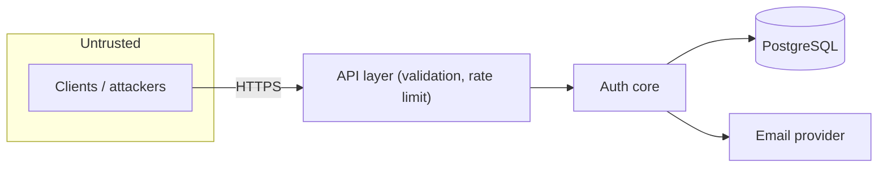

# Threat Model (STRIDE)
## Saim-AUS — Phase 1 Design

**Version:** 0.1 (Draft) · **Date:** 2026-09-22 · **Method:** STRIDE per data-flow

> Because Saim-AUS *is* a security control, the threat model is a first-class Phase 1
> deliverable. Each threat maps to a mitigation and back to a security requirement (SEC-x).

---

## 1. Scope & assets

**Assets to protect (in priority order):**
1. User credentials (passwords) and their hashes.
2. Session/refresh tokens and signing keys.
3. RBAC integrity (who can do what).
4. Personal data (email, activity, IPs).
5. Availability of the auth service.

**Trust boundaries:**
- Internet ↔ API layer (untrusted clients).
- API layer ↔ Auth core (trusted internal).
- Auth core ↔ Database / email provider (trusted infra, but secrets in transit).

---

## 2. STRIDE analysis

### S — Spoofing (pretending to be someone)
| Threat | Mitigation | Ref |
|--------|-----------|-----|
| Credential stuffing / brute force | Rate limiting, lockout, progressive delay; breached-password checks | SEC-3, FR-14 |
| Stolen access token replay | Short-lived access tokens (15m); HTTPS only | SEC-2, SEC-4 |
| Refresh token theft | Rotating single-use refresh + family revocation on reuse | SEC-4 |
| Phishing password resets | Single-use, time-limited, random reset tokens; no enumeration | SEC-7, SEC-12 |
| Weak/forged JWT | Strong signing keys, verify `alg`/`iss`/`exp`, reject `alg:none`, `kid` rotation | SEC-4 |

### T — Tampering (unauthorized modification)
| Threat | Mitigation | Ref |
|--------|-----------|-----|
| Token payload tampering | Signature verification on every request | SEC-4 |
| SQL injection | Parameterized queries / query builder; input validation | SEC-5 |
| Mass-assignment on profile/role updates | Explicit allow-lists; self-scoped fields only | SEC-9 |
| Privilege escalation via role edit | Only `role:manage`/`user:manage` can change RBAC; audit all | SEC-9, SEC-10 |

### R — Repudiation (denying an action)
| Threat | Mitigation | Ref |
|--------|-----------|-----|
| User/admin denies a privileged change | Append-only audit log with actor, event, timestamp | SEC-10, FR-30 |
| Log tampering | Structured logs shipped off-host; restricted write access | SEC-10 |

### I — Information Disclosure (leaking data)
| Threat | Mitigation | Ref |
|--------|-----------|-----|
| Password/hash leak | Argon2id hashing; never log secrets; least-privilege DB access | SEC-1, NFR-3 |
| Token leak via logs/URLs | Tokens never in URLs or logs; HttpOnly cookies | SEC-2, Privacy |
| User enumeration | Generic responses on login/register/reset; uniform timing | SEC-7 |
| PII exposure | Store IPs hashed; minimal PII; TLS in transit | NFR-16, SEC-2 |
| Verbose errors | Uniform error model; no stack traces to clients | §API error model |

### D — Denial of Service (availability)
| Threat | Mitigation | Ref |
|--------|-----------|-----|
| Login/refresh flooding | Rate limiting, bounded work per request | SEC-3, NFR-7 |
| Argon2 CPU exhaustion | Tuned cost + per-IP throttling on hashing endpoints | SEC-1, NFR-7 |
| DB connection exhaustion | Connection pooling, timeouts | NFR-7 |
| Large-payload abuse | Body size limits, schema validation | SEC-5 |

### E — Elevation of Privilege
| Threat | Mitigation | Ref |
|--------|-----------|-----|
| Accessing admin routes without rights | Deny-by-default guards; permission checks server-side | SEC-9 |
| Stale permissions after role change | `permVer` claim invalidates old snapshots | SEC-4 |
| IDOR (acting on others' resources) | Ownership checks; never trust client-supplied IDs alone | SEC-9 |
| Self-granting roles | Role assignment gated by `user:manage`; audited | SEC-9, SEC-10 |

---

## 3. Cross-cutting mitigations checklist

- [ ] TLS 1.2+ enforced; HSTS at proxy (SEC-2)
- [ ] Cookies: `HttpOnly; Secure; SameSite=Strict` (SEC-2, SEC-6)
- [ ] CSRF protection for cookie-based flows (SEC-6)
- [ ] Argon2id with tuned cost; unique salts (SEC-1)
- [ ] Rate limiting + lockout on auth endpoints (SEC-3)
- [ ] JWT: pinned algorithm, verified `iss`/`exp`, reject `alg:none` (SEC-4)
- [ ] Refresh rotation + reuse detection (SEC-4)
- [ ] Parameterized queries everywhere; schema validation (SEC-5)
- [ ] Generic auth errors; uniform response timing (SEC-7)
- [ ] Secrets/keys from env or secret store; rotation supported (SEC-8)
- [ ] Deny-by-default authorization on every protected op (SEC-9)
- [ ] Append-only audit log (SEC-10)
- [ ] Dependency/CVE scanning in CI; SBOM (SEC-11)
- [ ] Single-use, time-limited, random verification/reset tokens (SEC-12)
- [ ] Security headers (CSP where applicable, X-Content-Type-Options, etc.)

---

## 4. Residual risks & assumptions
- **Host security is the deployer's responsibility** — a compromised host or leaked signing
  key breaks all guarantees; document key management (SEC-8).
- **Email channel trust** — reset/verification security assumes the email account isn't
  compromised; MFA (FR-11) reduces reliance on email.
- **Deployment misconfiguration** — insecure defaults by integrators are a top risk; ship
  secure defaults and a hardening guide (Phase 6).

## 5. Verification plan (feeds Phase 5)
- Security test suite covering: authz bypass, brute force/lockout, token reuse/rotation,
  enumeration, injection, IDOR.
- Dependency scanning + static analysis in CI.
- Pre-release security review against this model and the SEC-x checklist.

## 6. Review cadence
Re-review this model at each milestone (M2–M7) and whenever a new endpoint, data flow, or
external integration is added.
